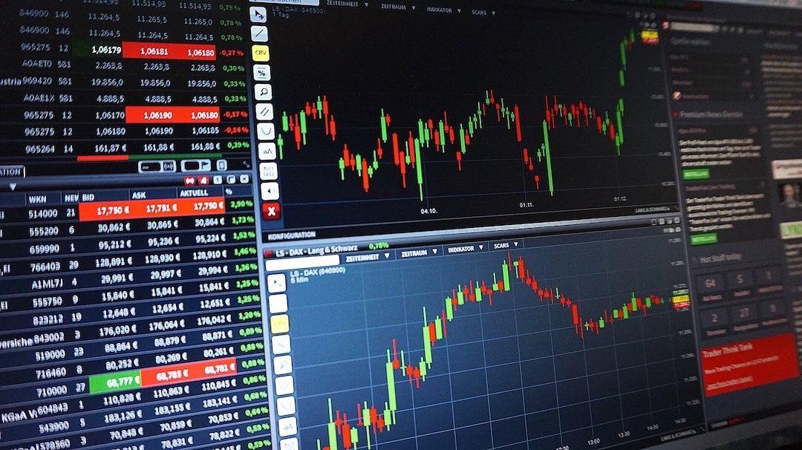

# Time Series

## Background

Use the time-series tools to predict future movements in the value of the Japanese yen versus the U.S. dollar.

Proficiency:

1. Time Series Forecasting
2. Linear Regression Modeling

- - -

### Files

[Time-Series Starter Notebook](time_series_analysis.ipynb)

[Linear Regression Starter Notebook](regression_analysis.ipynb)

[Yen Data CSV File](yen.csv)

- - -

### **Time-Series Forecasting**

Load historical Dollar-Yen exchange rate and apply time series analysis and modeling to determine whether there is any predictable behavior.

Complete the following:

1. Decomposition using a Hodrick-Prescott Filter (Decompose the Settle price into trend and noise).
2. Forecasting Returns using an ARMA Model.
3. Forecasting the Settle Price using an ARIMA Model.
4. Forecasting Volatility with GARCH.

* Based on your time series analysis, would you buy the yen now?
* Is the risk of the yen expected to increase or decrease?
* Based on the model evaluation, would you feel confident in using these models for trading?

### **Linear Regression Forecasting**

Build a Scikit-Learn linear regression model to predict Yen futures ("settle") returns with *lagged* Yen futures returns and categorical calendar seasonal effects (e.g., day-of-week or week-of-year seasonal effects).

Complete the following:

1. Data Preparation (Creating Returns and Lagged Returns and splitting the data into training and testing data)
2. Fitting a Linear Regression Model.
3. Making predictions using the testing data.
4. Out-of-sample performance. (Out-of-sample data is data that the model hasn't seen before (Testing data))
5. In-sample performance. (In-sample data is data that the model was trained on (Training data))

* Does this model perform better or worse on out-of-sample data compared to in-sample data?

